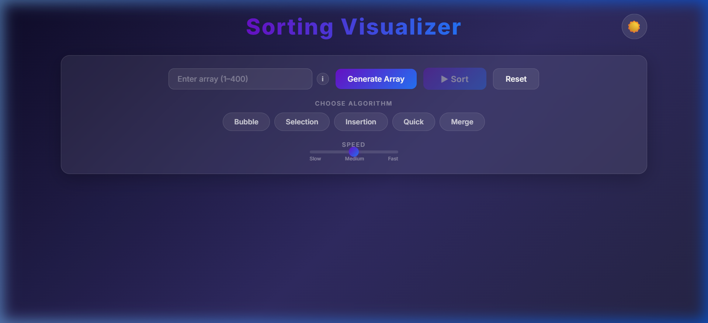
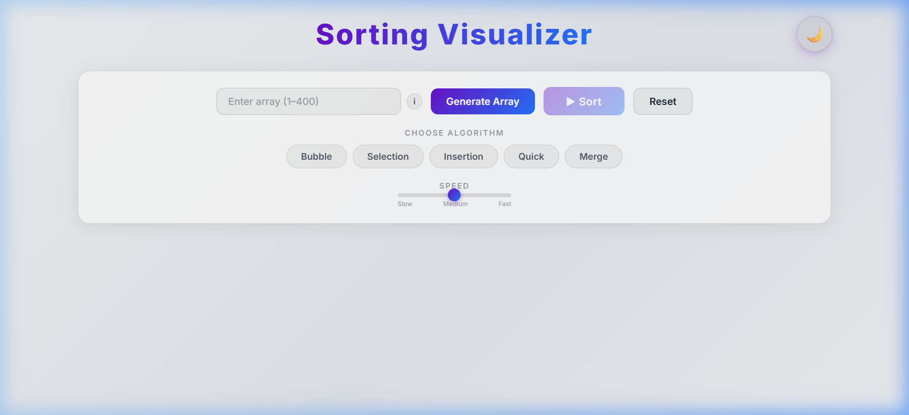
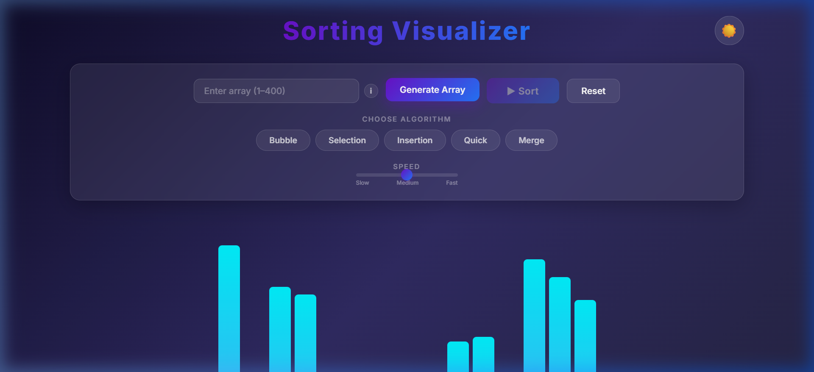
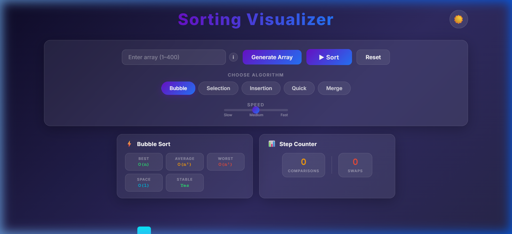

<div align="center">

# 🔄 Sorting Algorithm Visualizer

[](https://sorting-visualizer-yourusername.vercel.app)
[](https://react.dev)
[](https://vite.dev)
[](LICENSE)

**A modern, interactive sorting algorithm visualizer** built with React + Vite.  
Watch algorithms in action with live complexity analysis, step counters, and beautiful animations.

<br/>



</div>

---

## ✨ Features

| Feature | Description |
|---|---|
| 🎨 **Dark / Light Mode** | Toggle between stunning dark gradient and clean light themes |
| 📊 **Live Complexity Display** | See Best, Average, Worst time + Space complexity for each algorithm |
| 🔢 **Step Counter** | Real-time Comparisons & Swaps count during animation |
| 🔒 **Smart Controls** | All buttons auto-disable during sorting to prevent bugs |
| 💊 **Pill-Style Selector** | Algorithm selection via modern pill buttons instead of dropdowns |
| 🎛️ **Custom Speed Slider** | Adjust animation speed with Slow → Medium → Fast labels |
| 🧊 **Glassmorphism UI** | Frosted glass control panel with blur and transparency effects |
| ✨ **Glow Effects** | Comparing bars glow gold, swapping bars glow red, sorted bars glow green |
| 📱 **Fully Responsive** | Works on mobile, tablet, and desktop |

---

## 📸 Screenshots

<div align="center">

| Dark Mode | Light Mode |
|---|---|
|  |  |

| Bars with Gradient Fill | Algorithm Info Panel |
|---|---|
|  |  |

</div>

---

## 🧮 Supported Algorithms

| Algorithm | Best | Average | Worst | Space | Stable |
|---|---|---|---|---|---|
| **Bubble Sort** | O(n) | O(n²) | O(n²) | O(1) | ✅ |
| **Selection Sort** | O(n²) | O(n²) | O(n²) | O(1) | ❌ |
| **Insertion Sort** | O(n) | O(n²) | O(n²) | O(1) | ✅ |
| **Quick Sort** | O(n log n) | O(n log n) | O(n²) | O(log n) | ❌ |
| **Merge Sort** | O(n log n) | O(n log n) | O(n log n) | O(n) | ✅ |

---

## 🚀 Getting Started

### Prerequisites

- [Node.js](https://nodejs.org/) v16 or higher
- npm (comes with Node.js)

### Installation

```bash
# Clone the repository
git clone https://github.com/ShashankChaturvedi07/Sorting-Visualizer.git

# Navigate to the project
cd Sorting-Visualizer

# Install dependencies
npm install

# Start the development server
npm run dev
```

The app will open at `http://localhost:5173` 🎉

### Build for Production

```bash
npm run build
```

---

## 🏗️ Tech Stack

- **Framework:** React 19
- **Build Tool:** Vite
- **Styling:** Vanilla CSS with CSS Custom Properties (themes)
- **Fonts:** [Inter](https://fonts.google.com/specimen/Inter) via Google Fonts
- **Design:** Glassmorphism, gradients, micro-animations

---

## 📁 Project Structure

```
Sorting-Visualizer/
├── index.html
├── src/
│   ├── main.jsx
│   ├── index.css              # Global styles & CSS variables
│   ├── App.jsx                # Main app + animation logic
│   ├── App.css                # Layout & header styles
│   ├── Algorithms/
│   │   ├── BubbleSort.js
│   │   ├── SelectionSort.js
│   │   ├── InsertionSort.js
│   │   ├── QuickSort.js
│   │   └── MergeSort.js
│   └── Components/
│       ├── Bar.jsx / Bar.css         # Bar visualization
│       ├── Control.jsx / Control.css # Control panel (pills, slider)
│       └── InfoPanel.jsx / InfoPanel.css  # Complexity & counters
└── screenshots/
```

---

## 🤝 Contributing

Contributions are welcome! Feel free to open issues and pull requests.

1. Fork the repo
2. Create your feature branch (`git checkout -b feature/amazing-feature`)
3. Commit your changes (`git commit -m 'Add amazing feature'`)
4. Push to the branch (`git push origin feature/amazing-feature`)
5. Open a Pull Request

---

## 📄 License

This project is open source and available under the [MIT License](LICENSE).

---

<div align="center">
  <sub>Built with ❤️ by <a href="https://github.com/ShashankChaturvedi07">Shashank Chaturvedi</a></sub>
</div>
